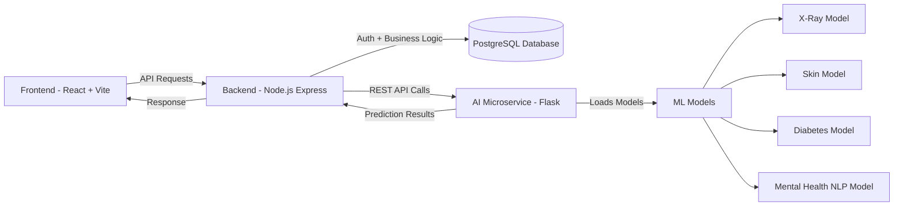

# 🏥 MediScan AI

**MediScan AI** is a production-ready, AI-powered digital health screening platform designed to assist in preliminary clinical assessment. It leverages Computer Vision, NLP, and risk-scoring algorithms to provide fast, intelligent health insights.

> ⚠️ **Clinical Disclaimer**
> MediScan AI is not a medical diagnostic tool. It is intended only for preliminary screening. All outputs must be reviewed by a licensed healthcare professional before making any medical decisions.

---

## 🌟 Features

### 🔬 Multi-Modal AI Screening

* **🩻 Chest X-Ray Analysis**

  * Detects pulmonary anomalies
  * Uses DenseNet (torchxrayvision) and Vision Transformers (ViT)

* **🔍 Skin Disease Detection**

  * Identifies dermatological abnormalities
  * Works on uploaded image data

* **🩸 Diabetes Risk Calculator**

  * Computes metabolic risk scores
  * Based on BMI, age, and symptoms

* **🧠 Mental Health NLP Analysis**

  * Analyzes free-form text
  * Detects emotional distress patterns

---

### ⚡ High-Performance AI Engine

* Persistent Flask microservice
* Preloaded ML models
* Fast inference time (1–2 seconds)

---

### 📊 Smart Clinical Reports

* Structured triage reports
* Risk bands and severity levels
* Demographic-based insights
* Print-ready format

---

### 🎨 Modern UI/UX

* Dark and Light mode
* Glassmorphism-inspired design
* Clean, minimal interface
* Built with Outfit font

---

### 🌍 Accessibility

* Bilingual support:

  * English
  * Urdu

---

### 🔒 Security

* JWT-based authentication
* Password hashing with bcrypt
* Secure PostgreSQL storage

---

## 🏗️ Architecture

MediScan AI follows a three-tier scalable architecture:

### 📌 Architecture Diagram



---

### 💻 Frontend (Client)

* React 19 with Vite
* Tailwind CSS v4
* React Query and Context API
* Shadcn UI and Radix UI

---

### ⚙️ Backend (API Layer)

* Node.js with Express (TypeScript)
* PostgreSQL using pg
* JWT authentication
* Acts as a bridge between frontend and AI microservice

---

### 🤖 AI Microservice

* Python Flask
* PyTorch and Transformers
* TorchXRayVision

**📡 Exposed Endpoints:**

```bash id="m7e6o2"
/analyze/xray
/analyze/skin
/analyze/diabetes
/analyze/mental-health
```

---

## 🚀 Getting Started

### ✅ Prerequisites

* Node.js (v18 or higher)
* Python (3.11 or higher)
* PostgreSQL
* Git

---

## 🗄️ Database Setup

```sql id="w9k8xm"
CREATE DATABASE mediscan;
```

---

## ⚙️ Environment Variables

Create a `.env` file in the backend directory:

```env id="8j8f0y"
DB_HOST=localhost
DB_PORT=5432
DB_NAME=mediscan
DB_USER=postgres
DB_PASSWORD=your_password

JWT_SECRET=your_secret_key

PORT=5000
PYTHON_SERVICE_URL=http://localhost:5001
```

---

## 📦 Installation

### Backend

```bash id="7o0dfg"
cd backend
npm install
```

### Frontend

```bash id="7u4z7k"
cd frontend
npm install
```

### AI Microservice

```bash id="t3z1ke"
cd mediscan-models
pip install -r requirements.txt
```

---

## ▶️ Running the Application

### 1️⃣ Start AI Service (Start First)

```bash id="q6ktqt"
cd mediscan-models
python server.py
```

### 2️⃣ Start Backend

```bash id="x9yq9k"
cd backend
npm run dev
```

### 3️⃣ Start Frontend

```bash id="rzn4g3"
cd frontend
npm run dev
```

🌐 Open in browser:

```id="1h4p8v"
http://localhost:5173
```

---

## 📂 Project Structure

```id="p2x1fz"
MediScan-AI/

├── backend/
│   ├── src/
│   │   └── index.ts
│   └── package.json

├── frontend/
│   ├── src/
│   │   ├── components/
│   │   ├── contexts/
│   │   ├── pages/
│   │   │   └── App.tsx
│   │   └── index.css
│   └── package.json

├── mediscan-models/
│   ├── diabetes-model/
│   ├── triage_engine.py
│   └── server.py

└── README.md
```

---

## 🤝 Contributing

* Fork the repository
* Create a feature branch
* Submit a pull request

---

## 🔮 Future Improvements

* Real-time doctor integration
* Mobile application
* Expanded disease detection models
* AI explainability dashboard

---

## 👩‍💻 Authors

* **Nabiha Nasir**
* **Zubair**

Cyber and Software Engineering Enthusiasts focused on building real-world AI systems in healthcare
